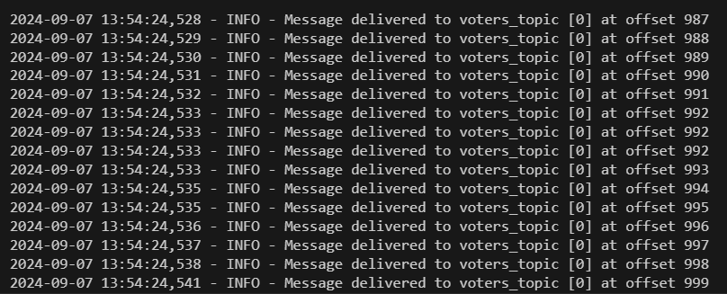
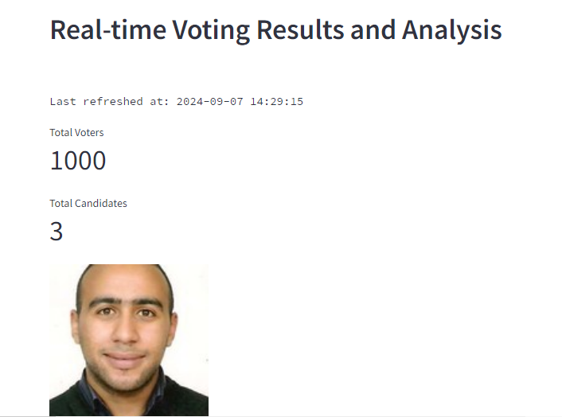

# Election Dashboard Project

## Overview
This project consists of a data pipeline and a real-time dashboard for tracking election voting results. It uses Apache Kafka for real-time data streaming, PostgreSQL for data storage, Apache Spark for data processing, and Streamlit for interactive visualizations.

## Components
1. Kafka Consumer and Producer
The Kafka consumer reads votes data from Kafka topics and writes aggregated results to other topics. The producer sends vote data to Kafka.

2. Spark Streaming
The Spark job processes real-time vote data from Kafka, performs aggregations, and writes results to Kafka topics for further analysis.

3. Streamlit Dashboard
A Streamlit dashboard provides real-time visualizations and statistics for election results. It displays:

* Total voters and candidates
* Vote counts per candidate
* Vote distribution through bar and donut charts

## Requirements
Python 3.11.4
Apache Kafka
Apache Spark 3.5.2
PostgreSQL 15
Docker (for running Kafka, Spark, and PostgreSQL)
Streamlit
Matplotlib
Pandas
psycopg2
kafka-python
simplejson
streamlit_autorefresh

## Scripts

1. **main.py**: This script performs the following tasks:

* Connects to a PostgreSQL database.
* Creates tables for candidates, voters, and votes if they do not already exist.
* Generates candidate and voter data from an API.
* Inserts candidate and voter data into the PostgreSQL database.
* Produces voter data to a Kafka topic.

2. **voting.py**: This script handles the processing of voting data:

* Connects to the PostgreSQL database and fetches candidate data.
* Consumes voter data from a Kafka topic.
* Inserts votes into the PostgreSQL database.
* Produces aggregated vote data to a Kafka topic.

3. **spark_stream.py**:This script performs real-time analytics on vote data:

* Initializes a Spark session with Kafka and PostgreSQL configurations.
* Defines a schema for the vote data.
* Reads streaming data from a Kafka topic.
* Aggregates total votes per candidate and voter turnout per location.
* Writes aggregated data back to Kafka topics.

4. **streamlit-app.py**: This script handles the visualization and and update of aggregated voting results in realtime as voting is being streamed.

